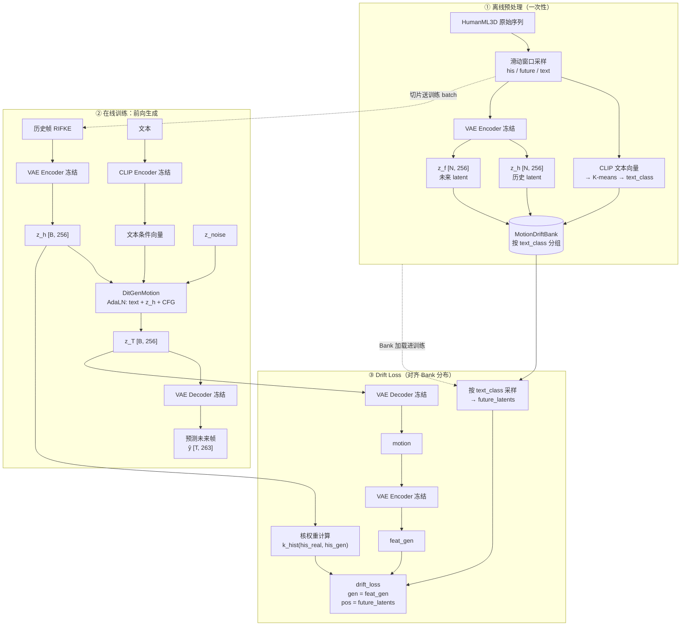
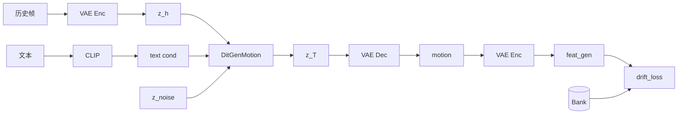

# Drifting Motion Generation — 实施方案 Pipeline

> 将 Drifting（Generative Modeling via Drifting, arXiv:2602.04770）范式迁移到动作生成领域，以 HumanML3D 为数据集，MLD 的数据处理和 VAE 为基础。

---

## 一、整体架构图

下图按 **离线建库 → 在线前向 → Drift 损失** 三块拆开，避免把预处理、生成与损失画进同一张杂线网里。



**读图要点**：

- **① 离线**：原始序列 → 滑动窗口 → VAE encode his/future 得到 `z_h, z_f` → 按 text_class 存入 Bank。
- **② 在线前向**：`z_h` + text + `z_noise` → **DitGenMotion** → `z_T` → **VAE Decoder** → 预测帧 `ŷ`（生成路径）。
- **③ Drift 路径**：`z_T` → **VAE decode** → **VAE encode** 得 `feat_gen` → 与 **Bank 按 text_class 采样**的 `future_latents` + **核权重** → `drift_loss`。
- **gen 不是 z_T**：drift_loss 的 `gen` 是生成帧的 VAE 特征 `feat_gen`，不是直接用 latent `z_T`。完整路径是：`z_T` → **VAE Decoder** → motion → **VAE Encoder** → `feat_gen`，即先 decode 再 encode。
- **Bank 存的是 future latent**：Bank 按 text_class 存 `z_f [N, 256]`，供 drift_loss 做正负样本。

**单条样本张量流（缩略）**：



**数据流三阶段**：
1. **离线预处理**：滑动窗口采样 → CLIP 聚类 → MotionDriftBank 构建
2. **在线训练**：模型生成 + drift_loss（核加权）→ 梯度更新
3. **推理评估**：单步生成 + MLD 评估指标

---

## 二、数据处理管线

### 2.1 数据来源（复用 MLD）

- 数据集：`HumanML3D`，263维 RIFKE 特征（root+ric+rot6d+vel+feet）
- 归一化：`(motion - mean) / std`，`unit_length=4`
- 工具函数复用：`lengths_to_mask()`、`remove_padding()`、`collate_tensors()`

### 2.2 滑动窗口采样（离线预处理）

对每条长序列进行重叠滑动窗口采样，生成 `(his, future, text)` 三元组。

**初版固定配置**：
- `his_len = 20`（历史帧长度）
- `future_len = 25`（未来帧长度）
- `stride = 5`（重叠采样，充分利用数据）
- `max_total_len = 45`（his_len + future_len，padding 到固定长度）

> 初版采用固定窗口长度，简化实验流程，便于快速验证 Drift Loss 的有效性。后续通过消融实验探索变长窗口的泛化效果（见第十三节实验 K）。

### 2.3 文本聚类（离线预处理）

用 CLIP encoder 提取所有切片的 text embedding → K-means 聚类为 N 个 text_class（建议 N=512）。聚类结果作为 MotionDriftBank 的组织依据。

---

## 三、特征提取与 VAE

### 3.1 VAE（直接复用 MLD）

- **Encoder**：冻结 MLD 预训练的 VAE Encoder，用于提取历史帧/预测帧的 latent
- **Decoder**：复用 MLD VAE Decoder，将生成的 latent 解码为动作特征
- **Latent 配置**：`[1, 256]`（单 token，直接够用；后续如需帧级细粒度控制可升级到 `[8, 256]`）

### 3.2 特征提取器（冻结）

直接用 MLD VAE Encoder 输出 `[B, 256]` 作为 drift_loss 的特征输入。零训练成本，快速验证。

---

## 四、模型架构：DitGenMotion（LightningDiT → 1D DiT）

### 4.1 核心改造点

| 改造点 | 原版 | 改造后 |
|--------|------|--------|
| Patchify | 2D ([H/p, W/p] 网格) | **1D**（时序 token） |
| 位置编码 | 2D SinCos | **1D SinCos** |
| RoPE | 2D RoPE | **1D RoPE**（见 `Drifting_Model/models/generator.py`） |
| 条件注入 | 仅类别嵌入 | **文本 + 历史帧 + CFG → AdaLN** |

### 4.2 模型配置

```
hidden_size: 768, depth: 12, num_heads: 12, cond_dim: 768
use_qknorm: True, use_rmsnorm: True, use_rope: True, use_swiglu: True
```

### 4.3 条件构建

```
文本条件 (CLIP 512d) → Dense(768)
历史帧条件 (VAE latent → mean+std → Dense(768))
CFG 尺度 → CFG Embed → Dense(768)
─────────────────────────────────────────
cond = class_emb + text_cond + history_cond + cfg_emb * 0.02
→ AdaLN → LightningDiTBlock × 12 → 输出 z_T [B, 256]
```

---

## 五、Drift Loss（直接复用）

`drift_loss.py` 无需修改，调用接口如下：

```python
# feat_gen: z_T → VAE decode → motion → VAE encode 的特征 [B, 256]
# future_latents: Bank 中采样的未来帧 latent [N, 256]
# w_kernel: k_hist(his_real, feat_gen) 核加权 [B, N]
loss, info = drift_loss(
    gen=feat_gen,              # [B, 256]
    fixed_pos=future_latents,  # [N_pos, 256]
    fixed_neg=neg_latents,     # [N_neg, 256] — 同 text_class 中不同 his 的样本
    weight_gen=jnp.ones(B),
    weight_pos=w_kernel_pos,   # kernel(his_real, his_gen)
    weight_neg=w_kernel_neg,
    R_list=(0.1, 0.5, 1.0),    # 动作领域初始值，需调优
)
```

### 5.1 关键参数初始值

| 参数 | 初始值 | 说明 |
|------|--------|------|
| `R_list` | `[0.1, 0.5, 1.0]` | 动作特征更粗糙，需更大 R |
| `pos_per_sample` | 16-32 | 数据量小，减少正样本增加多样性 |
| `neg_per_sample` | 32-64 | 增加负样本有助于区分语义 |

---

## 六、Memory Bank：MotionDriftBank

### 6.1 设计思路

将 **文本离散匹配** 与 **历史帧连续相似度** 解耦：

```
正样本权重: k_hist(his_real, his_gen) = exp(-||his_real - his_gen||² / 2σ²)
负样本权重: 1.0 (固定)

k_text 仅决定正负归属，不参与联合加权：
  - 同类聚类 → 正样本候选 → 乘 k_hist 权重
  - 不同类聚类 → 负样本 → 权重固定为 1.0
```

**关键洞察**：
- 历史帧相似的正样本（同类且 his 相似）：**引力增强**，拉动生成样本向其靠近
- 历史帧相似的负样本（同类但 action 不同）：**斥力增强**，推开生成样本
- 不同类负样本：直接作为负样本，无需 k_hist 加权（避免权重被 text_mask 归零）

### 6.2 Bank 结构

```
{
  text_class [512] × max_size [64]:
    ├── his_features:  [N, 256]  — 历史帧 latent (用于 k_hist 核权重)
    └── future_latents: [N, 256]  — 未来帧 latent (作为 drift_loss 的 pos/neg)
}
```

> **Bank 存什么**：只存 latent，不存原始 RIFKE。`his_features` 用于计算核权重 `k_hist(his_real, his_gen)`；`future_latents` 作为 drift_loss 的目标分布样本。

### 6.3 负样本采样

**推荐：Hard Negative Mining** — 优先采样 hist 最相似的负样本（最危险的"以假乱真"竞争者），按 hist 相似度加权采样。

### 6.4 离线构建流程

```
滑动窗口切片数据集
    → CLIP encode text → K-means → text_class
    → VAE encode his  → his_features  [N, 256]
    → VAE encode fut  → future_latents [N, 256]
    → 存入 MotionDriftBank (按 text_class 分组)
    → 保存到 disk (只需执行一次)
```

---

## 七、训练流程

### 7.1 离线 → 在线完整流程

```
【离线（只做一次）】
HumanML3D → 滑动窗口采样 → CLIP+K-means聚类 → MotionDriftBank → disk

【在线训练循环】
for batch in dataloader:
    ① his/future → VAE encode → z_h, z_f
    ② z_noise + z_h + text → DitGenMotion → z_T
    ③ `z_T` → **VAE decode** → **motion** → **VAE encode** → `feat_gen`  ← drift_loss 的 gen
    ④ Bank 按 text_class 采样 future_latents
    ⑤ k_hist(his_real, feat_gen) → 核权重 w
    ⑥ drift_loss(gen=feat_gen, pos=future_latents, w)
    ⑦ 梯度更新
```

### 7.2 与 MLD 核心对比

| 方面 | MLD | Drifting Motion |
|------|-----|-----------------|
| 优化目标 | 去噪得分匹配 | 特征空间漂移 |
| 生成方式 | 多步迭代 (N=50-100) | **单步** |
| 推理速度 | 慢 | **快** |
| 显存占用 | 中（需维护扩散过程） | **低** |

### 7.3 推荐超参

```yaml
# 数据
his_len_range: [10, 30]     # 随机历史帧
future_len_range: [10, 40]  # 随机预测帧
num_text_classes: 512       # CLIP+K-means 聚类数
max_size_per_class: 64

# 模型
hidden_size: 768, depth: 12, num_heads: 12
latent_dim: [1, 256]

# 训练
batch_size: 64, lr: 2e-4, ema_decay: 0.999
pos_per_sample: 16, neg_per_sample: 32
kernel.sigma: 0.1, kernel.hard_neg: true
cfg_min: 1.0, cfg_max: 2.0, no_cfg_frac: 0.1
R_list: [0.1, 0.5, 1.0]
```

---

## 八、推理与评估

### 8.1 推理

给定 `history_motion` + `text` + `cfg_scale`：
1. VAE encode his → `z_h`
2. CLIP encode text → `text_emb`
3. 采样 `z_noise`
4. 单步前向：`z_T = model(z_noise, z_h, text_emb, cfg_scale)`
5. VAE decode：`future_motion = vae.decode(z_T)`
6. 反标准化 → SMPL 可视化

### 8.2 评估指标（复用 MLD）

| 指标 | 说明 |
|------|------|
| **FID** | 特征分布距离（MLD T2M_MotionEncoder） |
| **R-Precision** | 文本-动作检索精度 top-k |
| **MM Dist** | 文本-动作余弦距离 |
| **Diversity** | 生成样本多样性 |

---

## 九、实施路线图

> 以下按**实施顺序**列出所有实现事项，按依赖关系分组，不含时间规划。

---

### 阶段 0：环境准备与数据验证

**0.1 环境与依赖**
- 安装/验证 HumanML3D 数据集下载与预处理脚本（MLD `datasets/` 目录）
- 确认 PyTorch + PyTorch Lightning + Flax/JAX 双框架共存（Drift Loss 用 JAX，模型训练用 PyTorch）
- 验证 MLD 数据加载流程端到端可运行（`train.py` 在 HumanML3D 上可启动训练）

**0.2 数据加载验证**
- 复用 MLD `mld/data/humanml/dataset.py` 的 `Text2MotionDatasetV2`，确认可正常读取 motion + text
- 确认 RIFKE 263-dim 特征提取、归一化（mean/std）流程
- 确认 `lengths_to_mask`、`remove_padding`、`collate_tensors` 工具函数可用

**0.3 评估管线验证**
- 复用 MLD `test.py` + `mld/models/metrics/` 评估脚本，确认 FID、R-Precision、MM Dist、Diversity 可正常计算
- 在 HumanML3D 测试集上跑一遍 MLD 基线（已有预训练权重），记录基线指标

> **阶段 0 交付物**：可运行的数据加载 + 评估管线，基线指标记录。

---

### 阶段 1：VAE 与 CLIP 编码器复用（冻结）

**1.1 VAE 加载与冻结**
- 复用 MLD 预训练 VAE 权重（`mld/models/architectures/mld_vae.py` 的 `MldVae`）
- 确认 VAE Encoder 输出 `[B, 1, 256]` latent，Decoder 可正确重建 RIFKE 特征
- 将 VAE Encoder/Decoder 冻结（`requires_grad=False`），仅用于特征提取

**1.2 CLIP 文本编码器复用**
- 复用 MLD `mld/models/architectures/mld_clip.py` 的 `MldTextEncoder`
- 确认 CLIP ViT-B/32 或 ViT-L/14 可对文本描述生成 512d 向量
- 冻结 CLIP 编码器（`requires_grad=False`）

**1.3 特征提取测试**
- 用 VAE Encoder 对随机 motion 片段提取 latent，验证形状 `[B, 1, 256]`
- 用 CLIP 对文本提取向量，验证形状 `[B, 512]`
- 确认 VAE encode → decode 重建误差在合理范围（定性验证）

> **阶段 1 交付物**：可独立工作的 VAE + CLIP 特征提取模块。

---

### 阶段 2：滑动窗口采样与 MotionDriftBank 离线构建

**2.1 滑动窗口采样脚本**
- 实现 `his/future/text` 三元组采样逻辑（`his_len=20`, `future_len=25`, `stride=5`）
- 对 HumanML3D 每条长序列进行重叠采样，生成切片数据集
- 验证切片数据的 motion 长度、文本对应关系正确

**2.2 CLIP 聚类**
- 对所有切片的文本用 CLIP 编码
- 用 K-means 将文本向量聚类为 N 个 text_class（初始 N=512）
- 保存聚类标签（每个切片对应一个 text_class）

**2.3 MotionDriftBank 离线构建**
- 对每个切片：用冻结的 VAE Encoder 提取 `his_features [N, 256]` 和 `future_latents [N, 256]`
- 按 text_class 分组存储，每个 class 最多存 max_size=64 条
- 保存到 disk（pickle/npz 格式），结构为 `{text_class: {his_features, future_latents}}`

> **阶段 2 交付物**：`MotionDriftBank.pkl`，包含按文本聚类组织的 latent bank。

---

### 阶段 3：1D DiT 模型 DitGenMotion 搭建

**3.1 1D Patchify 与位置编码**
- 将 LightningDiT 的 2D Patchify 改造为 1D：输入 `[B, T, C]` → patchify → `[B, N, D]`
- 实现 1D SinCos 位置编码（替换 2D SinCos）
- 实现 1D RoPE（`apply_rope_1d`，见 `Drifting_Model/models/generator.py` 改造）

**3.2 条件注入（AdaLN）**
- 构建 `cond = class_emb + text_cond + history_cond + cfg_emb * 0.02`
  - `text_cond`: CLIP 512d → Dense(768)
  - `his_cond`: VAE latent → mean+std → Dense(768)
  - `cfg_emb`: CFG 标量 → CFG Embed → Dense(768)
- 确认 AdaLN 调制（shift/scale/gate）在每个 LightningDiTBlock 中正确注入

**3.3 模型配置**
- 配置：`hidden_size=768, depth=12, num_heads=12, cond_dim=768`
- 开启 `use_qknorm=True, use_rmsnorm=True, use_rope=True, use_swiglu=True`
- 输出层：1D unpatchify 将 `[B, N, D]` 还原为 `[B, T, 256]`（latent 序列）

**3.4 单步前向验证**
- 输入：随机 `z_noise [B, 1, 256]` + `z_h [B, 1, 256]` + `text_emb [B, 512]`
- 确认输出形状 `[B, 1, 256]`，梯度可正常回传

> **阶段 3 交付物**：可独立前向的 `DitGenMotion` 模型，条件注入正确。

---

### 阶段 4：Drift Loss 接入（PyTorch-JAX 桥接）

**4.1 PyTorch → JAX 数据转换**
- 实现 `torch.Tensor → jnp.ndarray` 转换函数（用于 VAE Encoder 输出）
- drift_loss.py 输入格式：`gen [B, 256, 1]`、`fixed_pos [N_pos, 256, 1]`、`fixed_neg [N_neg, 256, 1]`
- 确认张量形状和设备（JAX 在 TPU/GPU，PyTorch 在 CUDA）数据传输正确

**4.2 drift_loss 调用集成**
- 按 `pipeline.md` 第五节接口调用 drift_loss：
  - `gen = feat_gen`：生成帧的完整路径是 `z_T` → VAE decode → motion → VAE encode → `[B, 256]`
  - `fixed_pos = future_latents`：Bank 中采样的未来帧 latent `[N_pos, 256]`
  - `fixed_neg = neg_latents`：同 text_class 中 his 相似的负样本 `[N_neg, 256]`
  - `weight_pos = k_hist(his_real, his_gen)`：历史帧核加权
  - `R_list = [0.1, 0.5, 1.0]`：动作领域初始值

**4.3 drift_loss 反传桥接**
- 将 JAX 计算的 `drift_loss` 标量通过 `jax.grad` 获取梯度
- 将梯度从 JAX 数组转回 PyTorch 参数量，实现与 PyTorch 优化器兼容
- （备选：全程用 JAX 训练，后续评估时用 PyTorch — 需额外开发 PyTorch 版本的 LightningDiTBlock）

> **阶段 4 交付物**：drift_loss 可在 PyTorch 训练循环中调用，梯度可正常反传。

---

### 阶段 5：完整训练循环

**5.1 数据加载器适配**
- 实现 motion + text 的 DataLoader，返回 `his [B, T_his, 263]`、`future [B, T_fut, 263]`、`text [B, str]`
- 实现 collate_fn 处理变长序列（padding 到固定长度）

**5.2 单 batch 训练步骤**
```
for batch in dataloader:
    ① his/future → VAE encode → z_h [B, 1, 256], z_f [B, 1, 256]
    ② z_noise + z_h + text_emb → DitGenMotion → z_T [B, 1, 256]
    ③ `z_T` → VAE decode → motion → VAE encode → `feat_gen` [B, 1, 256]  ← drift_loss 的 gen
    ④ Bank 按 text_class 采样 future_latents + his_features
    ⑤ k_hist(his_real, feat_gen) → 核权重 w_kernel
    ⑥ drift_loss(gen=feat_gen, pos=future_latents, neg=neg_latents, w)
    ⑦ 梯度更新 DitGenMotion
```

**5.3 训练稳定性**
- 设置 CFG（classifier-free guidance）：训练时 10% 概率 drop 文本条件
- CFG scale：`cfg_min=1.0, cfg_max=2.0`
- EMA（指数移动平均）：ema_decay=0.999
- 学习率：`lr=2e-4`，AdamW 优化器

**5.4 Loss 监控**
- 记录 `drift_loss` 总损失及各级 R 的分量（`loss_0.1`, `loss_0.5`, `loss_1.0`）
- 记录 `scale`（特征空间缩放因子），监控训练稳定性

> **阶段 5 交付物**：完整训练脚本，可收敛的 drift_loss 曲线。

---

### 阶段 6：推理与可视化 ✅ 已完成

**6.1 单步推理脚本** ✅
- `inference.py` 实现完整推理流程：
  1. VAE encode his → `z_h`
  2. CLIP encode text → `text_emb`
  3. 采样 `z_noise`
  4. 单步前向：`z_T = model(z_noise, z_h, text_emb, cfg_scale)`
  5. VAE decode：`future_motion = vae.decode(z_T)`
  6. 反标准化 → 输出 `.npy`

**6.2 SMPL 可视化集成** ✅
- `dmg/transforms/feats2joints.py`：RIFKE → 3D 关节坐标（复用 MLD 逻辑）
- `dmg/visualize.py`：独立可视化脚本，支持：
  - `matplotlib` 3D 动画（`--mode anim`）
  - `Blender` 视频渲染（`--mode video`）
  - 关节坐标保存（`--mode joints`）
- `inference.py`：推理时自动生成可视化文件

> **阶段 6 交付物**：推理脚本 + 可视化输出，验证生成动作的合理性。

---

### 阶段 7：评估与消融实验

**7.1 全指标评估**
- 在 HumanML3D 测试集上计算：FID、R-Precision (top-1/2/3)、MM Dist、Diversity
- 对比 MLD 基线（多步推理）和本方法（单步推理）的指标差异

**7.2 第一批消融实验**
- **A**：特征提取器（VAE freeze vs Motion MAE vs T2M_MotionEncoder）
- **B**：R_list 尺度（`[0.1, 0.5, 1.0]` vs `[0.05, 0.2, 0.8]` vs `[0.2, 0.8, 2.0]`）
- **C**：历史帧核宽度 σ（`0.1` vs `0.2` vs 无 hard_neg）
- **E**：Loss 组合（drift_loss only vs drift + MSE）

**7.3 第二批消融实验（滑动窗口）**
- **K1**：固定窗口长度（his=20/future=25 vs his=10/future=20 vs his=30/future=40）
- **K2**：随机多窗口（固定 vs his∈[10,30]/future∈[10,40]随机）
- **K3**：Padding 策略（zero vs repeat vs random）

**7.4 分析与总结**
- 汇总各消融实验的 FID/R-Precision 变化曲线
- 分析 drift_loss 各 R 分量的贡献
- 撰写实验报告，标注最优配置

> **阶段 7 交付物**：完整评估报告，包含基线对比 + 消融实验结果。

---

### 实施顺序依赖关系图

```
阶段 0（数据验证）
    │
    ├──────────────────────────────────┐
    ▼                                  ▼
阶段 1（VAE+CLIP）              阶段 2（Bank 构建）
（前置：阶段 0）               （前置：阶段 1）
    │                                  │
    │◄─────────────────────────────────┘
    ▼
阶段 3（1D DiT 模型）
（前置：阶段 1）
    │
    ▼
阶段 4（Drift Loss 接入）
（前置：阶段 1 + 阶段 2 + 阶段 3）
    │
    ▼
阶段 5（完整训练循环）
（前置：阶段 4）
    │
    ├────────────┐
    ▼            ▼
阶段 6（推理）  阶段 7（评估）
（前置：阶段 5）  （前置：阶段 5 + 阶段 6）
```

> **关键路径**：阶段 0 → 1 → 3 → 4 → 5 → 7  
> **并行可做**：阶段 2（Bank 构建，依赖阶段 1 完成后独立进行）、阶段 6（推理，与阶段 5 并行开发）

---

## 十、可复用组件索引

| 组件 | 来源 | 位置 |
|------|------|------|
| HumanML3D 加载 / RIFKE 特征 / 归一化 | MLD | `mld/data/humanml/dataset.py` |
| `lengths_to_mask`, `remove_padding`, `collate_tensors` | MLD | `mld/utils/temos_utils.py`, `mld/data/utils.py` |
| MLD VAE Encoder / Decoder | MLD | `mld/models/architectures/mld_vae.py` |
| CLIP 文本编码器 | MLD | `mld/models/architectures/mld_clip.py` |
| 评估指标 (FID, R-Precision, MM Dist) | MLD | `mld/test.py`, `mld/models/modeltype/` |
| `feats2joints` 可视化 | MLD | `mld/transforms/feats2smpl.py` |
| `drift_loss`, `cdist` | Drifting | `Drifting_Model/drift_loss.py` |
| `LightningDiTBlock`, `AdaLN`, `TimestepEmbedder` | Drifting | `Drifting_Model/models/generator.py` |
| 1D RoPE 改造 | 本项目 | 见本文 四.1 节 |
| MotionDriftBank | 本项目 | 见本文 六节 |
| `apply_rope_1d` | 本项目 | 见 `Drifting_Model/models/generator.py` 改造 |

---

## 十一、关键风险

| 风险 | 概率 | 影响 | 应对 |
|------|------|------|------|
| HumanML3D 数据量小（~15K），drift_loss 过拟合 | 中 | 高 | 减小 pos_per_sample，增加负样本 |
| R_list 参数在动作领域不 work | 低 | 高 | 系统性搜索 `[0.05, 0.2, 0.8]` 初始 |
| 单步生成质量不如 MLD 多步 | 中 | 中 | 接受速度优势，追求 FID 和多样性 |
| 文本聚类数选择不当 | 中 | 中 | 先用 512，后续可调 |
| 历史帧核宽度 σ 选择不当 | 中 | 中 | σ ∈ {0.05, 0.1, 0.2} 搜索 |
| 滑动窗口重叠导致样本多样性不足 | 中 | 中 | 增大 stride（如 10） |

---

## 十二、待设计/待优化问题

以下为 pipeline 中**尚未敲定、需进一步设计或实验**的关键问题：

### 12.1 数据处理

| 问题 | 说明 | 优先级 |
|------|------|--------|
| **his_feat 提取方式** | MotionDriftBank 中 his_feat 用 VAE encode 还是 PCA/均值？ | 🔴 需设计 |
| **聚类数 N** | CLIP+K-means 聚类数选 256/512/1024？太少语义混杂，太多样本稀疏 | 🔴 需实验 |
| **CLIP 选型** | CLIP ViT-B/32 vs ViT-L/14？ViT-L 效果更好但编码慢 | 🟡 可选 |
| **Bank 在线 vs 离线更新** | 离线构建一次 vs 训练中动态更新？动态更新更灵活但增加复杂度 | 🟡 待定 |

### 12.2 模型架构

| 问题 | 说明 | 优先级 |
|------|------|--------|
| **DiT depth** | 12 层是否足够？原 Drifting 用 28 层，动作序列可能需要更深 | 🔴 需实验 |
| **his_cond 注入方式** | AdaLN（当前） vs Cross-Attention vs 拼接？AdaLN 更轻量但表达力受限 | 🔴 需实验 |
| **无条件基线建立** | class_embed 用什么初始化？全零？可学习？ | 🟡 待定 |

### 12.3 Drift Loss

| 问题 | 说明 | 优先级 |
|------|------|--------|
| **R_list 调优** | 动作领域初始值 `[0.1, 0.5, 1.0]` 是否合适？需系统性搜索 | 🔴 需实验 |
| **σ 调优** | 历史帧核宽度 σ ∈ {0.05, 0.1, 0.2, 0.5}？影响核加权效果 | 🔴 需实验 |
| **loss 组合** | drift_loss 与 MSE/重建 loss 的权重 λ？纯 drift_loss vs drift + MSE | 🔴 需实验 |
| **正负样本数比例** | pos=16, neg=32 是否最优？比例如何影响漂移力平衡 | 🟡 待实验 |

### 12.4 评测

| 问题 | 说明 | 优先级 |
|------|------|--------|
| **评估特征提取器** | 用 MLD T2M_MotionEncoder vs VAE Encoder vs CLIP？不同特征器 FID 差异大 | 🔴 需实验 |
| **ground-truth 对齐** | 推理时生成长度 vs 训练时随机长度，如何公平对比 | 🟡 待定 |

---

## 十三、消融实验清单（第一批）

以下为已敲定方案的可替换选项，作为**第一批消融实验**：

| 编号 | 固定基准 | 消融维度 | 候选选项 |
|------|----------|----------|----------|
| **A** | MLD VAE Encoder freeze | **特征提取器** | ① MLD VAE Encoder freeze（当前） ② Motion MAE（多尺度） ③ T2M_MotionEncoder |
| **B** | R_list=[0.1,0.5,1.0] | **R_list 尺度** | ① [0.1, 0.5, 1.0]（当前） ② [0.05, 0.2, 0.8] ③ [0.2, 0.8, 2.0] |
| **C** | σ=0.1, hard_neg=True | **历史帧核** | ① σ=0.1 + hard_neg（当前） ② σ=0.2 + hard_neg ③ σ=0.1, 无 hard_neg |
| **D** | CLIP+K-means 512类 | **文本聚类数** | ① 512（当前） ② 256 ③ 1024 |
| **E** | drift_loss 单独 | **Loss 组合** | ① drift_loss only（当前） ② drift + MSE(λ=0.1) ③ drift + MSE(λ=1.0) |
| **F** | his_cond=AdaLN | **his_cond 注入方式** | ① AdaLN（当前） ② Cross-Attention ③ 拼接 |
| **G** | [1, 256] latent | **Latent token 数** | ① [1, 256]（当前） ② [8, 256] ③ [16, 256] |

**实验顺序建议**：A → B → C → E（核心消融），D → F → G（架构探索，可并行）

### 13.2 消融实验清单（第二批）：滑动窗口采样

> **动机**：初版采用固定窗口长度（his_len=20, future_len=25）以快速验证 Drift Loss。后续通过以下实验探索变长窗口对模型泛化能力的影响。

#### 实验 K：滑动窗口采样策略

|| 编号 | 固定基准 | 消融维度 | 候选选项 |
||------|----------|----------|----------|
|| **K1** | his=20, future=25, 固定 | **窗口长度** | ① his=20, future=25（当前固定） ② his=10, future=20 ③ his=30, future=40 |
|| **K2** | 固定窗口 | **随机多窗口** | ① 固定（当前） ② his∈[10,30], future∈[10,40]随机 ③ his∈[10,30], future∈[10,60]随机 |
|| **K3** | max_total_len=45, zero padding | **Padding 策略** | ① zero padding（当前） ② repeat padding ③ random padding |

**实验说明**：
- **K1**：验证不同固定窗口长度对生成质量的影响，his 决定历史条件信息量，future 决定预测目标长度
- **K2**：探索随机多窗口训练是否提升推理时的长度泛化能力（支持任意合理帧数）
- **K3**：验证不同 padding 策略对模型学习的影响，repeat padding 保留时序连续性，random padding 增加多样性

**评估重点**：
- **长度泛化**：推理时使用训练未见过的窗口长度（如 his=15, future=35），验证泛化效果
- **FID/R-Precision**：确保变长策略不损害生成质量
- **长度-质量曲线**：绘制 his/future 长度 vs 生成质量的曲线，识别最优窗口区间

### 13.3 消融实验清单（第三批）：SE3 不变架构

> **动机**：当前方案使用 MLD VAE Encoder，其特征提取能力受限于训练数据分布。若在 Encoder 或 Transformer 层面引入 **SE3 不变性**（对刚体旋转 R 和平移 t 的不变性），理论上可增强模型对不同角色朝向、不同初始位置的泛化能力，尤其在多角色场景或相机视角变化时。

#### 核心概念：SE3 不变性

```
SE3 = { (R, t) | R ∈ SO(3), t ∈ R³ }  — 3D 刚体变换群

SE3 不变性要求：
  f((R, t) · x) = f(x)    — 特征对旋转/平移保持不变

在动作生成中的意义：
  - 不同角色朝向 → 全局旋转不变
  - 相机视角变化 → 平移不变
  - 数据增强自由度提升
```

#### 实验 H：SE3 不变 VAE Encoder

| 编号 | 固定基准 | 消融维度 | 候选选项 |
|------|----------|----------|----------|
| **H1** | MLD VAE Encoder freeze（当前） | **SE3 不变 VAE** | ① MLD VAE freeze（当前基准） ② SE3-Invariant VAE Encoder ③ Vposer（SMPL 先验） |

**技术方案**：
- **方案① MLD VAE freeze**：直接复用 MLD 预训练的 VAE Encoder，不做修改
- **方案② SE3-Invariant VAE Encoder**：在 VAE Encoder 基础上增加：
  - 输入层：对 root 轨迹做全局对齐（去根 / 去除旋转）
  - 特征层：使用 E(3) 等变网络层（Equivariant Graph Network）
  - 输出层：提取 SE3 不变的 latent 特征
- **方案③ Vposer（SMPL 先验）**：使用 SMPL 参数空间的 VPoser 隐变量，天然具备姿态空间不变性

**实现要点**：

```python
# SE3-Invariant VAE Encoder 改造点
class SE3InvariantVAEEncoder(nn.Module):
    """
    在 MLD VAE Encoder 基础上增加 SE3 不变性约束
    """
    def __init__(self, mld_vae_encoder):
        super().__init__()
        self.mld_encoder = mld_vae_encoder  # 冻结预训练权重

        # 新增：几何归一化层
        self.geometric_norm = GeometricNorm3D()  # 去根 + 去旋转

        # 新增：等变特征层
        self.equivariant_layers = EquivariantMLP(latent_dim=256)

    def forward(self, motion, root_pos, root_rot):
        # Step 1: 几何归一化（使特征 SE3 不变）
        motion_normalized = self.geometric_norm(motion, root_pos, root_rot)

        # Step 2: 原 VAE 编码
        z = self.mld_encoder(motion_normalized)

        # Step 3: 等变特征精炼
        z = self.equivariant_layers(z)

        return z
```

**预期影响**：
- ✅ 泛化到不同朝向/位置的角色
- ✅ 与其他消融实验（A1-A3）互补
- ⚠️ 实现复杂度中等（需修改 Encoder 输入层）
- ⚠️ 可能损失部分细粒度位置信息

---

#### 实验 I：SE3 不变 Transformer 条件注入

| 编号 | 固定基准 | 消融维度 | 候选选项 |
|------|----------|----------|----------|
| **I1** | his_cond=AdaLN（非 SE3 不变） | **SE3 不变条件注入** | ① AdaLN（当前基准） ② SE3-Invariant AdaLN ③ 等变 Cross-Attention |

**技术方案**：
- **方案① AdaLN（当前）**：使用 AdaLN 将 his_cond 注入 DiT，不考虑几何不变性
- **方案② SE3-Invariant AdaLN**：在 AdaLN 的条件向量构建中引入 SE3 不变特征：
  - his_cond 从几何归一化后的 latent 构建
  - 条件向量具备旋转/平移不变性
- **方案③ 等变 Cross-Attention**：使用 E(3) 等变注意力替代标准 Cross-Attention

**实现要点**：

```python
# SE3-Invariant AdaLN 改造点
class SE3InvariantAdaLN(nn.Module):
    """
    在 AdaLN 基础上增加 SE3 不变性约束
    """
    def __init__(self, hidden_size, cond_dim):
        super().__init__()
        self.adaLN = AdaLN(hidden_size, cond_dim)

        # 新增：SE3 不变特征投影
        self.se3_projection = SE3InvariantProjection(cond_dim)

    def forward(self, x, his_cond, root_pos, root_rot):
        # Step 1: his_cond 投影为 SE3 不变向量
        cond_se3 = self.se3_projection(his_cond, root_pos, root_rot)

        # Step 2: 标准 AdaLN 注入
        return self.adaLN(x, cond_se3)
```

**与实验 H 的关系**：
- H 关注 **特征提取器** 的 SE3 不变性（输入端）
- I 关注 **条件注入** 的 SE3 不变性（交互端）
- 两者可独立实验，也可组合（最佳方案）

---

#### 实验 J：综合对比（SE3 不变 vs 标准）

| 消融组合 | Encoder | his_cond | 预期效果 |
|----------|---------|----------|----------|
| **J1**（当前） | MLD VAE | AdaLN | 基准性能 |
| **J2** | SE3-Invariant VAE | AdaLN | 验证 H 的独立效果 |
| **J3** | MLD VAE | SE3-Invariant AdaLN | 验证 I 的独立效果 |
| **J4** | SE3-Invariant VAE | SE3-Invariant AdaLN | 验证组合效果 |

**评估重点**：
- **朝向鲁棒性**：测试不同 root_rot 下的生成质量
- **位置鲁棒性**：测试不同 root_pos 下的生成质量
- **FID/R-Precision**：确保 SE3 不变性不损害生成质量
- **消融分析**：量化 SE3 不变性的贡献

---

#### 第三批消融实验汇总表（SE3 不变架构）

| 编号 | 固定基准 | 消融维度 | 候选选项 |
|------|----------|----------|----------|
| **H** | MLD VAE Encoder freeze | **SE3 不变 VAE Encoder** | ① MLD VAE freeze（当前基准） ② SE3-Invariant VAE Encoder ③ Vposer（SMPL 先验） |
| **I** | his_cond=AdaLN（非 SE3 不变） | **SE3 不变条件注入** | ① AdaLN（当前基准） ② SE3-Invariant AdaLN ③ 等变 Cross-Attention |
| **J** | 当前方案 | **SE3 不变综合对比** | J1（基准）→ J2（H）→ J3（I）→ J4（H+I） |

---

## 附录 A：代码审查 Bug 修复记录

### 待观察的配置问题

| 问题 | 文件 | 严重程度 | 状态 | 说明 |
|------|------|----------|------|------|
| **滑动窗口归一化时机** | `dmg/data/sliding_window.py` 第189-192行 | 🟡 中等 | ⚠️ 待观察 | 反归一化 `* std + mean` 的正确性取决于 `motion_dir` 的数据是原始尺度还是已归一化 |
| **CLIP 设备一致性** | `dmg/models/architectures/mld_clip.py` 第160行 | 🟡 中等 | ⚠️ 待观察 | `encode_text_with_prompt` 方法中 `text_tokens` 可能需要显式转移到 `self.clip_device` |
| **正样本采样不足** | `dmg/data/bank.py` 第254-257行 | 🟡 中等 | ⚠️ 待观察 | 当类别样本数 `< num_pos` 时返回所有可用样本而非填充 |

---

## 附录 B：条件融合设计待消融验证

当前实现（`dit_gen_motion.py` §6）：

```python
# 文本条件: CLIP 512d → Dense(768)
text_cond = self.text_proj(text_emb)

# 历史帧条件: VAE latent → mean+std → Dense(768)
z_h_mean = z_h.mean(dim=1)
z_h_std = z_h.std(dim=1) + 1e-6
his_cond = self.his_proj(concat([z_h_mean, z_h_std]))

# CFG 嵌入: 标量 → TimestepEmbedder → RMSNorm * 0.02
cfg_emb = self.cfg_norm(self.cfg_embedder(cfg_scale_t)) * 0.02

# 条件融合: 直接相加
cond = text_cond + his_cond + cfg_emb
```

### 待消融验证的设计问题

| 问题 | 当前设计 | 可能的改进方案 | 预期收益 |
|------|----------|----------------|----------|
| **历史帧条件压缩** | `mean + std` 压到 2N 维 | ① Temporal attention pooling ② 直接 MLP 展平 ③ Learnable pooling | 保留更多时序结构信息 |
| **CFG 权重方式** | `* 0.02` 全局削弱 | ① 直接相加（让网络自己学权重）② Gate 机制：`gate * cfg_emb` | 更灵活的条件控制 |
| **条件融合方式** | 直接相加 | ① MLP 融合：`MLP(concat([A, B, C]))` ② FiLM 调制 ③ 交叉注意力 | 学习条件间的交互关系 |
| **CFG Embedding** | TimestepEmbedder (MLP) | 简化为：`MLP(scalar → [B, 1] → [B, 768])` | 减少参数量 |

### 消融实验设计

```python
# 消融 A: 历史帧条件编码
A1 = "mean+std (当前基准)"
A2 = "temporal attention pooling"
A3 = "展平 + MLP"

# 消融 B: CFG 权重方式
B1 = "* 0.02 (当前)"
B2 = "直接相加 (无缩放)"
B3 = "gate 机制: cond + gate(cfg) * cfg_emb"

# 消融 C: 条件融合
C1 = "直接相加 (当前)"
C2 = "MLP 融合"
C3 = "FiLM: cond = text_cond + his_cond * scale(cfg_emb) + shift(cfg_emb)"
```

### 评估指标

- **FID**: 生成动作质量
- **Diversity**: 动作多样性
- **R-Precision**: 文本-动作匹配度
- **收敛速度**: 训练 loss 下降曲线

---
